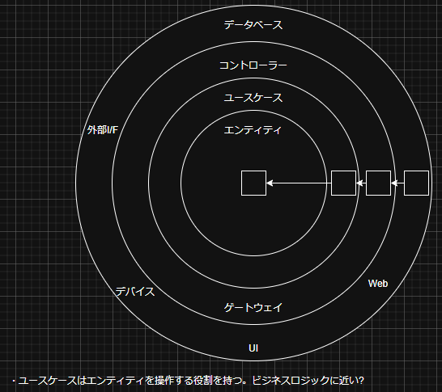
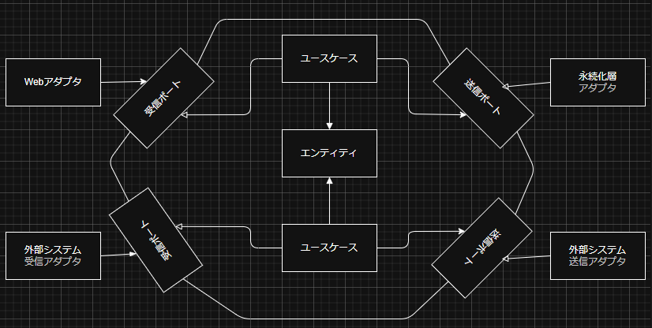
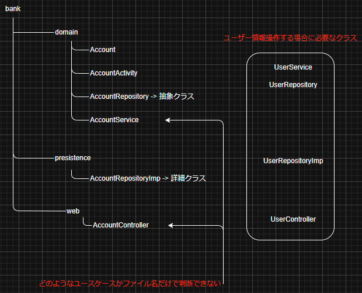
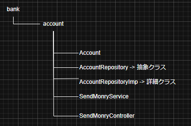
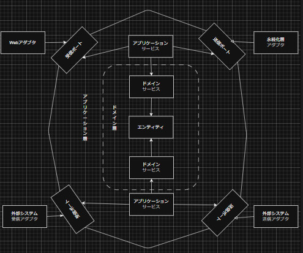
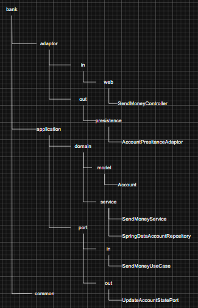
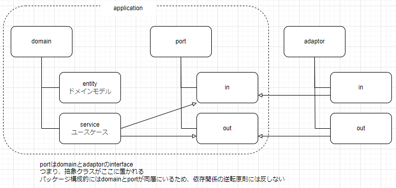
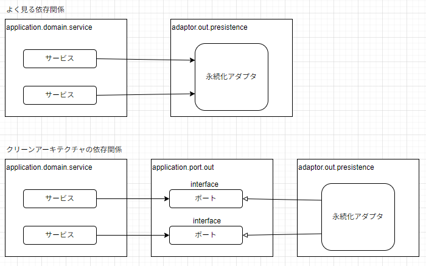
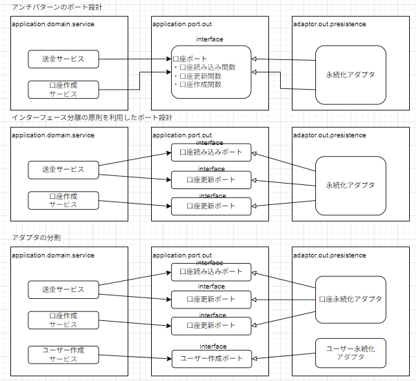

# はじめに
このリポジトリは[手を動かしてわかるクリーンアーキテクチャ ヘキサゴナルアーキテクチャによるクリーンなアプリケーション開発](https://book.impress.co.jp/books/1123101096)を勉強した結果を残すものです  
自分なりの理解をpythonで実装していきます

# 依存関係の逆転
  
上図のようにデータベースなどの下位モジュールは中心のドメインに依存する形で存在する  
本来は上位モジュールであるドメインが下位モジュールを使用するが、インターフェース等を挟むことにより依存関係が逆転している  
詳しくは[依存関係逆転の原則について勉強してみた](https://qiita.com/maru3745/items/0e09365c9848f849de4f)の記事を参考にしてください  
しかし、ORMを使うとなるとドメインと永続化層が同じエンティティを持つ必要性がある(永続化層のエンティティをドメインに持ってこれないから)  
## ヘキサゴナルアーキテクチャ
  
*上記はポート&アダプタとも呼ばれる
- アダプタ: アプリケーションの核とコミュケーションを取る
- ポート: アプリケーションとアダプタのインターフェース。アダプタがどのようにアプリケーションとコミュケーションを取るかをつかさどる
- ビジネスロジックはユースケースを実現するクラスやエンティティに実装される

ビジネスロジックを永続化層特有の問題やUI特有の問題から切り離すことによって、**変更する理由を少なくする**  
つまりは、**保守をより簡単に行える**ということにも繋がる  

# パッケージ構成戦略
## 層を意識した構成
  
フォルダをそのまま層の単位にしたパッケージ構成  
依存関係の逆転の原則は遵守できるが、以下のような問題が出てくる(図の赤字の部分)  
### 問題
- 機能が増えると各フォルダに各クラスが必要になり、クラスが増殖する
- ファイル名だけ見てもどのようなユースケースがあるかが分からない(ファイルの中身を確認する必要あり)  

## 機能を意識したパッケージ構成
  
口座(account)に関するフォルダを切る  
口座に関する部分をフォルダに集める  
また、AccountServiceとなっていた部分をSendMonrySeriveとすることでコードを見なくても、「送金」に関わるクラスであると判断することができる  
同じパッケージでしか使用しないクラスを**プライベートパッケージ**とすることでパッケージ外からのアクセスを禁止して、関連のない機能が間違って依存することを抑制することができる  
### 問題
- パッケージを見ても何のアーキテクチャを採用しているか分からない
- 層を意識した構成に比べると依存関係の逆転原則が遵守しずらい

## アーキテクチャを意識したパッケージ構成
今回のポート&アダプタアーキテクチャをきちんと確認すると、パッケージ構成は以下のようになる  
  
  
  

- DBを変更したい際はadaptorの部分を別に切り替えるだけでよく、portは関係しない
- portは外部とコミュケーションを取るインターフェースであるため、アプリケーションのコアとして扱うことができ、domainと同じ階層にいる。依存関係の逆転原則を実装するためにadaptorがportに依存する形になっている
- commonは全体で使用する関数とかを格納する
- アーキテクチャとパッケージ構成を同じにすることで、どのパッケージにどのコードがあるかが分かるようになる
- adaptorはportを介して呼ばれる場合を除くと外部から呼ばれることはないので、プライベートパッケージでも問題ない
- portのインターフェースはadaptorから呼ばれるためpublic宣言が必要
- プロジェクトにあう確実なパッケージ構成を見つけるのは難しいが、アーキテクチャとコードの乖離を少なくすことはできる

自分なりにまとめる以下のような感じ  
  

# ユースケースの実装
## ユースケースの概要
ユースケースは次の手順で処理を進める
1. 入力値を受け取る
2. ビジネスルールに関する妥当性の確認を行う
3. ドメインモデルの状態を変更する
4. 処理結果を返す

ユースケースのコードはドメインロジックに目を向けるべきであり、入力値が正しいかは責務ではない  
**ビジネスルールに関する妥当性確認**はユースケースの責務である  

### 送金するユースケース
1. UIから送金指示
2. 送金できる状態であるかの確認(ビジネスルールに関する妥当性に該当)
3. 自分と送金相手の口座情報を書き換え(ドメインモデルの状態に該当)
4. 自分と送金相手の取引情報を書き換え(ドメインモデルの状態に該当)
5. 送金処理結果をadaporを介してUIに返却

## ビジネスルールに関する妥当性確認
入力値の妥当性確認は**構文的**なものであり、「数値型であるか」とかの文脈に依存しないもの  
ビジネスルールに関する妥当性確認は**意味的**なものであり、「口座額以上の金額を振り込めない」などの、ドメイン固有の文脈に依存している  
では、このビジネスルールが関係する処理はどこに書くのがいいのか?
### 濃いドメイン & 薄いドメイン
#### 濃いドメイン
ドメインエンティティにsetterやgetter以外にドメインに関する処理も記載する  
ビジネスルールはユースケースではなく、ドメインエンティティに実装される  
#### 薄いドメイン
setterやgetterだけをドメインエンティティに実装する  
ビジネスルールに関する処理はユースケースに記載する

# Webアダプタの実装
## Webアダプタの処理順
1. 送られてきたHTTPリクエストをプログラムで利用可能なオブジェクトに変換する
2. 認証/認可の確認
3. 入力値の妥当性確認
4. 入力値をユースケースの入力モデルに変換する
5. ユースケースを呼び出す
6. ユースケースの処理結果をHTTPレスポンスに変換する
7. HTTPレスポンスを返却する(今回はhandler層で実施)
## Webアダプタでやってはいけないこと
- HTTPに関する処理をアプリケーションの核に持ち込んではいけない -> HTTPに関することを全く扱わない他の受信アダプタからは呼び出せなくなってしまうから(よくわからない)
## コントローラーの分割
- ユースケースごとクラスを定義する(クラスの膨張を防ぐため)
  - クラスの内容が大きくなるとテストの量も大きくなり可読性が下がる
- 汎用的な入力モデルではなくユースケース専用の入力モデルとすることで他のユースケースで誤用されるのを防ぐ

# 永続化アダプタの実装
どのようにして依存の向きを逆にして、永続化アダプタをアプリケーション層に差し込むようにするのか  
  
## 永続化層の処理の流れ
1. 入力モデルを受け取る
2. 受け取った入力モデルをデータベースに対して操作を行えるものに変換する
3. その変換したものを使ってデータベースを操作する
4. データベースから返ってきた結果をアプリケーションが扱える出力モデルに変換する
5. その変換した結果モデルを返す

## ポート分割
  
### アンチパターン
- 特定のテーブル操作を行うリポジトリを1つだけ用意する
上記の内容は複数のサービスが1つのリポジトリに依存してしまい、肥大化した送信ポートになる  
### interface分離の原則
各サービスが必要するメソッドだけに依存するようにする  
ほとんどの各ポートが1つのメソッドだけを持つようになる  
サービスを実装するときは、必要なポートを差し込むだけを意識するようになり、不要な機能や実装の詳細に意識を向けなくてもよい  
*なお「1ポート1メソッド」という指針は状況によって、適用しないほうがいい
## 永続化アダプタ分割
1つのアダプタでも構わないし、ドメインの境界にそって、複数のアダプタクラスが存在してもよい  

# アーキテクチャの構成要素に対するテスト
## ドメインエンティティの検証:単体テスト
- ドメインが持つメソッドが正しく実行されたかを確認する
## 